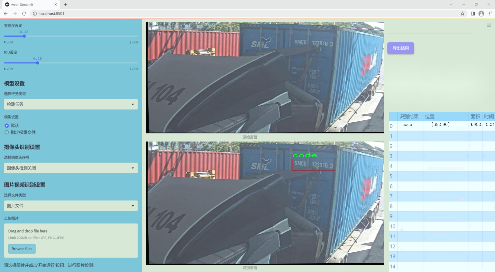
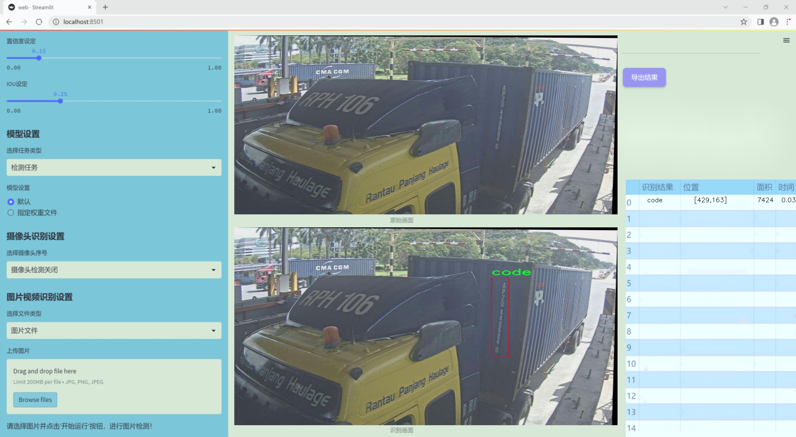
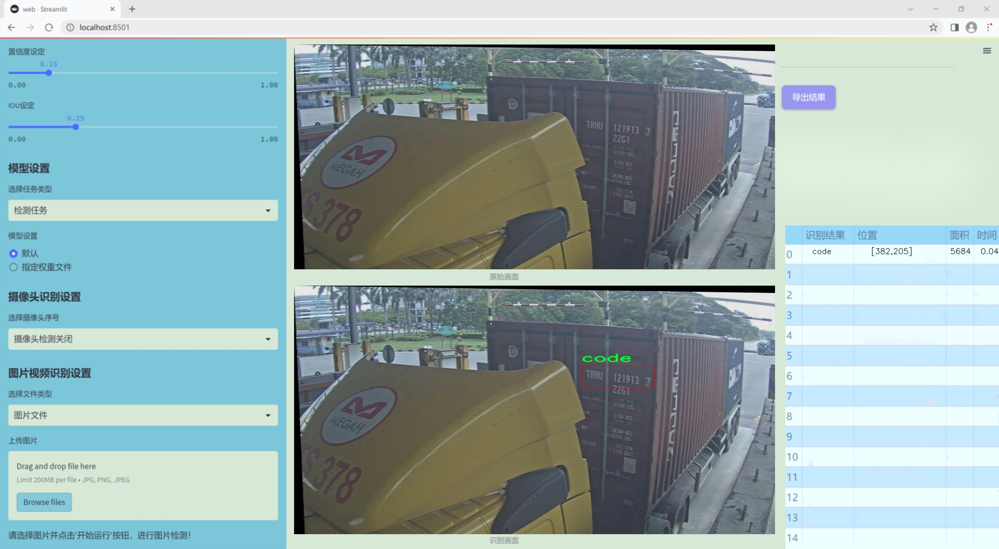
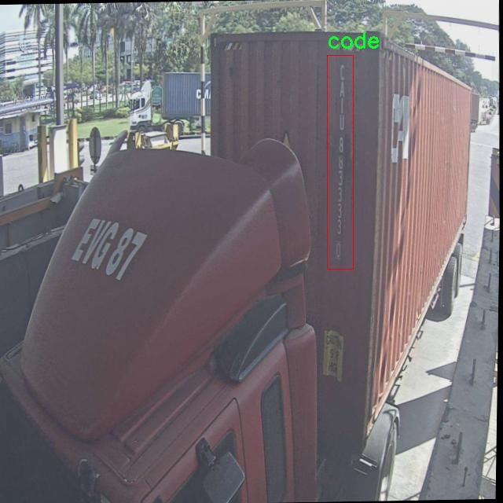
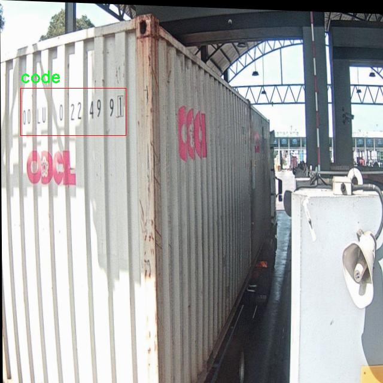
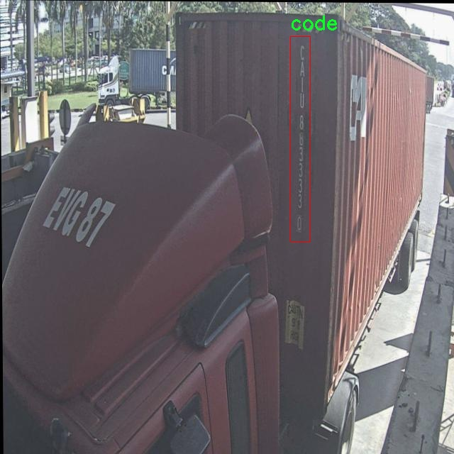
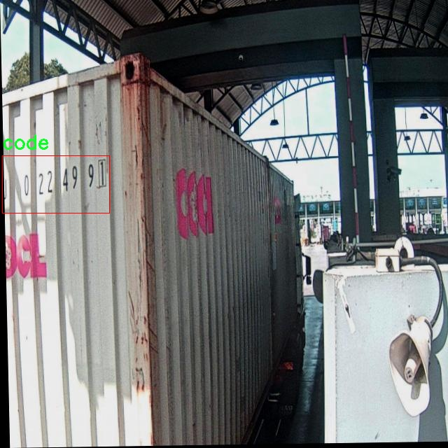
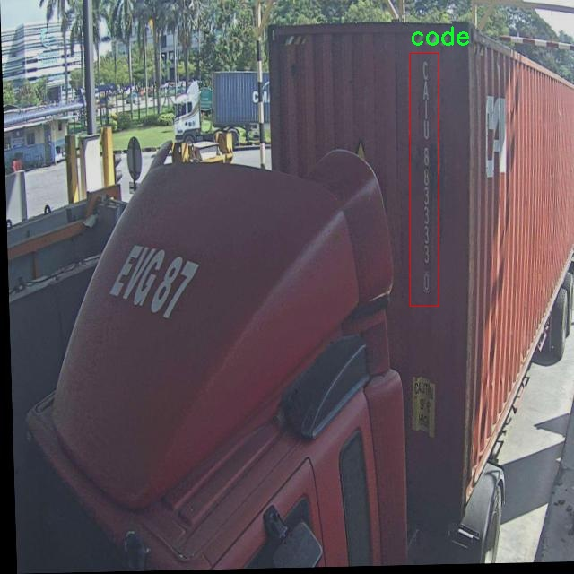

# 改进yolo11-CA-HSFPN等200+全套创新点大全：集装箱字符识别系统源码＆数据集全套

### 1.图片效果展示







##### 项目来源 **[人工智能促进会 2024.10.24](https://kdocs.cn/l/cszuIiCKVNis)**

注意：由于项目一直在更新迭代，上面“1.图片效果展示”和“2.视频效果展示”展示的系统图片或者视频可能为老版本，新版本在老版本的基础上升级如下：（实际效果以升级的新版本为准）

  （1）适配了YOLOV11的“目标检测”模型和“实例分割”模型，通过加载相应的权重（.pt）文件即可自适应加载模型。

  （2）支持“图片识别”、“视频识别”、“摄像头实时识别”三种识别模式。

  （3）支持“图片识别”、“视频识别”、“摄像头实时识别”三种识别结果保存导出，解决手动导出（容易卡顿出现爆内存）存在的问题，识别完自动保存结果并导出到tempDir中。

  （4）支持Web前端系统中的标题、背景图等自定义修改。

  另外本项目提供训练的数据集和训练教程,暂不提供权重文件（best.pt）,需要您按照教程进行训练后实现图片演示和Web前端界面演示的效果。

### 2.视频效果展示

[2.1 视频效果展示](https://www.bilibili.com/video/BV1Ao18YjEVe/)

### 3.背景

研究背景与意义

随着全球贸易的不断发展，集装箱作为现代物流的重要载体，其在运输过程中的信息识别与管理显得尤为重要。集装箱上的字符信息，如编号、条形码等，承载着货物的基本信息和运输指令，准确识别这些字符对于提高物流效率、降低误差率具有重要意义。然而，传统的字符识别方法在处理复杂背景、不同光照条件及字符变形等方面存在一定的局限性。因此，基于深度学习的图像识别技术，尤其是目标检测模型的应用，成为解决这一问题的有效途径。

YOLO（You Only Look Once）系列模型因其快速且高效的目标检测能力而广受欢迎。YOLOv11作为该系列的最新版本，进一步提升了检测精度和速度，适合在实时性要求较高的场景中应用。通过对YOLOv11进行改进，可以更好地适应集装箱字符识别的需求。针对数据集的特点，包含349张图像和2个类别（集装箱字符代码），我们可以通过数据增强、模型微调等技术手段，提升模型的泛化能力和识别准确率。

本研究旨在构建一个基于改进YOLOv11的集装箱字符识别系统，利用深度学习技术，提升集装箱字符的自动识别效率。通过该系统的实现，不仅可以减少人工识别的工作量，还能提高识别的准确性和速度，为集装箱运输管理提供智能化解决方案。随着集装箱运输量的不断增加，基于深度学习的字符识别技术将为物流行业的数字化转型提供重要支持，推动整个行业的智能化发展。

### 4.数据集信息展示

##### 4.1 本项目数据集详细数据（类别数＆类别名）

nc: 1
names: ['code']


该项目为【目标检测】数据集，请在【训练教程和Web端加载模型教程（第三步）】这一步的时候按照【目标检测】部分的教程来训练

##### 4.2 本项目数据集信息介绍

本项目数据集信息介绍

本项目所使用的数据集名为“Container Character Codes”，旨在为改进YOLOv11的集装箱字符识别系统提供支持。该数据集专注于集装箱上的字符识别，具有单一类别，具体为“code”。在现代物流和运输行业中，集装箱的字符信息承载着重要的运输和管理数据，因此，准确识别这些字符对于提高集装箱管理效率和减少错误至关重要。

“Container Character Codes”数据集经过精心设计，包含了大量真实场景下的集装箱字符图像。这些图像不仅涵盖了不同光照条件、角度和背景的变化，还考虑了各种集装箱的表面材质和磨损程度，确保了数据集的多样性和代表性。数据集中每个图像均经过标注，确保在训练过程中，YOLOv11模型能够有效学习到字符的特征和模式。

为了提升模型的泛化能力和识别准确率，数据集还包括了一些经过增强处理的图像，例如添加噪声、调整对比度和进行旋转等。这些增强技术旨在模拟实际应用中可能遇到的各种情况，使得训练出的模型在面对不同环境时依然能够保持较高的识别性能。

通过使用“Container Character Codes”数据集，本项目希望能够有效地训练出一个强大的字符识别系统，能够在各种复杂的实际应用场景中，快速而准确地识别集装箱上的字符信息，从而为集装箱的管理和物流运输提供更为高效的解决方案。











### 5.全套项目环境部署视频教程（零基础手把手教学）

[5.1 所需软件PyCharm和Anaconda安装教程（第一步）](https://www.bilibili.com/video/BV1BoC1YCEKi/?spm_id_from=333.999.0.0&vd_source=bc9aec86d164b67a7004b996143742dc)


[5.2 安装Python虚拟环境创建和依赖库安装视频教程（第二步）](https://www.bilibili.com/video/BV1ZoC1YCEBw?spm_id_from=333.788.videopod.sections&vd_source=bc9aec86d164b67a7004b996143742dc)

### 6.改进YOLOv11训练教程和Web_UI前端加载模型教程（零基础手把手教学）

[6.1 改进YOLOv11训练教程和Web_UI前端加载模型教程（第三步）](https://www.bilibili.com/video/BV1BoC1YCEhR?spm_id_from=333.788.videopod.sections&vd_source=bc9aec86d164b67a7004b996143742dc)


按照上面的训练视频教程链接加载项目提供的数据集，运行train.py即可开始训练



     Epoch   gpu_mem       box       obj       cls    labels  img_size
     1/200     20.8G   0.01576   0.01955  0.007536        22      1280: 100%|██████████| 849/849 [14:42<00:00,  1.04s/it]
               Class     Images     Labels          P          R     mAP@.5 mAP@.5:.95: 100%|██████████| 213/213 [01:14<00:00,  2.87it/s]
                 all       3395      17314      0.994      0.957      0.0957      0.0843

     Epoch   gpu_mem       box       obj       cls    labels  img_size
     2/200     20.8G   0.01578   0.01923  0.007006        22      1280: 100%|██████████| 849/849 [14:44<00:00,  1.04s/it]
               Class     Images     Labels          P          R     mAP@.5 mAP@.5:.95: 100%|██████████| 213/213 [01:12<00:00,  2.95it/s]
                 all       3395      17314      0.996      0.956      0.0957      0.0845

     Epoch   gpu_mem       box       obj       cls    labels  img_size
     3/200     20.8G   0.01561    0.0191  0.006895        27      1280: 100%|██████████| 849/849 [10:56<00:00,  1.29it/s]
               Class     Images     Labels          P          R     mAP@.5 mAP@.5:.95: 100%|███████   | 187/213 [00:52<00:00,  4.04it/s]
                 all       3395      17314      0.996      0.957      0.0957      0.0845


###### [项目数据集下载链接](https://kdocs.cn/l/cszuIiCKVNis)

### 7.原始YOLOv11算法讲解


##### YOLO11介绍

Ultralytics YOLO11是一款尖端的、最先进的模型，它在之前YOLO版本成功的基础上进行了构建，并引入了新功能和改进，以进一步提升性能和灵活性。
**YOLO11设计快速、准确且易于使用，使其成为各种物体检测和跟踪、实例分割、图像分类以及姿态估计任务的绝佳选择。**


**结构图如下：**


##### **C3k2**

**C3k2，结构图如下**


**C3k2，继承自类`C2f，其中通过c3k设置False或者Ture来决定选择使用C3k还是`**Bottleneck


**实现代码** **ultralytics/nn/modules/block.py**

##### C2PSA介绍

**借鉴V10 PSA结构，实现了C2PSA和C2fPSA，最终选择了基于C2的C2PSA（可能涨点更好？）**


**实现代码** **ultralytics/nn/modules/block.py**

##### Detect介绍

**分类检测头引入了DWConv（更加轻量级，为后续二次创新提供了改进点），结构图如下（和V8的区别）：**


### 8.200+种全套改进YOLOV11创新点原理讲解

#### 8.1 200+种全套改进YOLOV11创新点原理讲解大全

由于篇幅限制，每个创新点的具体原理讲解就不全部展开，具体见下列网址中的改进模块对应项目的技术原理博客网址【Blog】（创新点均为模块化搭建，原理适配YOLOv5~YOLOv11等各种版本）

[改进模块技术原理博客【Blog】网址链接](https://gitee.com/qunmasj/good)


#### 8.2 精选部分改进YOLOV11创新点原理讲解

###### 这里节选部分改进创新点展开原理讲解(完整的改进原理见上图和[改进模块技术原理博客链接](https://gitee.com/qunmasj/good)【如果此小节的图加载失败可以通过CSDN或者Github搜索该博客的标题访问原始博客，原始博客图片显示正常】
### 可变性卷积DCN简介
卷积神经网络由于其构建模块中固定的几何结构，本质上受限于模型几何变换。为了提高卷积神经网络的转换建模能力，《Deformable Convolutional Networks》作者提出了两个模块：可变形卷积（deformable convolution）和可变形RoI池（deformable RoI pooling）。这两个模块均基于用额外的偏移来增加模块中的空间采样位置以及从目标任务中学习偏移的思想，而不需要额外的监督。

第一次证明了在深度神经网络中学习密集空间变换（dense spatial transformation）对于复杂的视觉任务是有效的

视觉识别中的一个关键挑战是如何适应对象比例、姿态、视点和零件变形中的几何变化或模型几何变换。一般有两种方法实现：
1）建立具有足够期望变化的训练数据集。这通常通过增加现有的数据样本来实现，例如通过仿射变换。但是训练成本昂贵而且模型参数庞大。
2）使用变换不变（transformation-invariant）的特征和算法。比如比较有名的SIFT(尺度不变特征变换)便是这一类的代表算法。

但以上的方法有两个缺点：
1）几何变换被假定为固定的和已知的，这些先验知识被用来扩充数据，设计特征和算法。为此，这个假设阻止了对具有未知几何变换的新任务的推广，从而导致这些几何变换可能没有被正确建模。
2）对于不变特征和算法进行手动设计，对于过于复杂的变换可能是困难的或不可行的。

卷积神经网络本质上局限于模拟大型未知转换。局限性源于CNN模块的固定几何结构：卷积单元在固定位置对输入特征图进行采样；池化层以固定比率降低特征矩阵分辨率；RoI（感兴趣区域）池化层将RoI分成固定的空间箱（spatial bins）等。缺乏处理几何变换的内部机制。

这种内部机制的缺乏会导致一些问题，举个例子。同一个CNN层中所有激活单元的感受野大小是相同的，但是这是不可取的。因为不同的位置可能对应于具有不同尺度或变形的对象，所以尺度或感受野大小的自适应确定对于具有精细定位的视觉识别是渴望的。

对于这些问题，作者提出了两个模块提高CNNs对几何变换建模的能力。


deformable convolution（可变形卷积）
将2D偏移量添加到标准卷积中的常规网格采样位置，使得采样网格能够自由变形。通过额外的卷积层，从前面的特征映射中学习偏移。因此，变形采用局部、密集和自适应的方式取决于输入特征。


deformable RoI pooling（可变形RoI池化）
为先前RoI池化的常规库（bin）分区中的每个库位置（bin partition）增加了一个偏移量。类似地，偏移是从前面的特征图和感兴趣区域中学习的，从而能够对具有不同形状的对象进行自适应部件定位（adaptive part localization）。

#### Deformable Convolutional Networks
Deformable Convolution
2D卷积由两个步骤组成：
1）在输入特征图x xx上使用规则网格R RR进行采样。
2）把这些采样点乘不同权重w ww后相加。

网格R定义感受野大小和扩张程度，比如内核大小为3x3，扩张程度为1的网格R可以表示为：
R = { ( − 1 , − 1 ) , ( − 1 , 0 ) , … , ( 0 , 1 ) , ( 1 , 1 ) } R = \{(-1,-1),(-1,0),\dots,(0,1),(1,1)\}
R={(−1,−1),(−1,0),…,(0,1),(1,1)}

​
 一般为小数，使用双线性插值进行处理。（把小数坐标分解到相邻的四个整数坐标点来计算结果）


具体操作如图所示：


首先对输入特征层进行一个普通的3x3卷积处理得到偏移域（offset field）。偏移域特征图具有与输入特征图相同的空间分辨率，channels维度2N对应于N个2D（xy两个方向）偏移。其中的N是原输入特征图上所具有的N个channels，也就是输入输出channels保持不变，这里xy两个channels分别对输出特征图上的一个channels进行偏移。确定采样点后就通过与相对应的权重w点乘相加得到输出特征图上该点最终值。

前面也提到过，由于这里xy两个方向所训练出来的偏移量一般来说是一个小数，那么为了得到这个点所对应的数值，会采用双线性插值的方法，从最近的四个邻近坐标点中计算得到该偏移点的数值，公式如下：


具体推理过程见：双线性插值原理

#### Deformable RoI Poolingb
所有基于区域提议（RPN）的对象检测方法都使用RoI池话处理，将任意大小的输入矩形区域转换为固定大小的特征图。


 一般为小数，需要使用双线性插值进行处理。


具体操作如图所示：


当时看这个部分的时候觉得有些突兀，明明RoI池化会将特征层转化为固定尺寸的区域。其实，我个人觉得，这个部分与上述的可变性卷积操作是类似的。这里同样是使用了一个普通的RoI池化操作，进行一些列处理后得到了一个偏移域特征图，然后重新作用于原来的w × H w \times Hw×H的RoI。只不过这里不再是规律的逐行逐列对每个格子进行池化，而是对于格子进行偏移后再池化处理。

#### Postion﹣Sensitive RoI Pooling
除此之外，论文还提出一种PS RoI池化（Postion﹣Sensitive RoI Pooling）。不同于上述可变形RoI池化中的全连接过程，这里使用全卷积替换。

具体操作如图所示：


首先，对于原来的特征图来说，原本是将输入特征图上的RoI区域分成k × k k\times kk×k个bin。而在这里，则是将输入特征图进行卷积操作，分别得到一个channels为k 2 ( C + 1 ) k^{2}(C+1)k (C+1)的得分图（score maps）和一个channels为2 k 2 ( C + 1 ) 2k{2}(C+1)2k 2 (C+1)的偏移域（offset fields），这两个特征矩阵的宽高是与输入特征矩阵相同的。其中，得分图的channels中，k × k k \times kk×k分别表示的是每一个网格，C CC表示的检测对象的类别数目，1表示背景。而在偏移域中的2表示xy两个方向的偏移。
也就是说，在PS RoI池化中，对于RoI的每一个网格都独自占一个通道形成一层得分图，然后其对于的偏移量占两个通道。offset fields得到的偏移是归一化后的偏移，需要通过和deformable RoI pooling中一样的变换方式得到∆ p i j ∆p_{ij}∆p ij，然后对每层得分图进行偏移池化处理。最后处理完的结果就对应着最后输出的一个网格。所以其包含了位置信息。

原文论述为：


#### Understanding Deformable ConvNets
当可变形卷积叠加时，复合变形的效果是深远的。如图所示：


ps：a是标准卷积的固定感受野，b是可变形卷积的适应性感受野。

感受野和标准卷积中的采样位置在整个顶部特征图上是固定的(左)。在可变形卷积中，它们根据对象的比例和形状进行自适应调整(右)。


### 9.系统功能展示

图9.1.系统支持检测结果表格显示

  图9.2.系统支持置信度和IOU阈值手动调节

  图9.3.系统支持自定义加载权重文件best.pt(需要你通过步骤5中训练获得)

  图9.4.系统支持摄像头实时识别

  图9.5.系统支持图片识别

  图9.6.系统支持视频识别

  图9.7.系统支持识别结果文件自动保存

  图9.8.系统支持Excel导出检测结果数据


### 10. YOLOv11核心改进源码讲解

#### 10.1 RFAConv.py

以下是对给定代码的核心部分进行提炼和详细注释的结果。主要保留了关键的类和方法，去掉了一些冗余的部分。

```python
import torch
import torch.nn as nn
from einops import rearrange

# 定义高斯激活函数
class h_sigmoid(nn.Module):
    def __init__(self, inplace=True):
        super(h_sigmoid, self).__init__()
        self.relu = nn.ReLU6(inplace=inplace)  # 使用ReLU6作为基础激活函数

    def forward(self, x):
        return self.relu(x + 3) / 6  # 实现h-sigmoid的前向传播

# 定义高斯激活函数的另一种形式
class h_swish(nn.Module):
    def __init__(self, inplace=True):
        super(h_swish, self).__init__()
        self.sigmoid = h_sigmoid(inplace=inplace)  # 使用h_sigmoid作为基础

    def forward(self, x):
        return x * self.sigmoid(x)  # 实现h-swish的前向传播

# RFAConv类实现了一个基于注意力机制的卷积层
class RFAConv(nn.Module):
    def __init__(self, in_channel, out_channel, kernel_size, stride=1):
        super().__init__()
        self.kernel_size = kernel_size

        # 生成权重的卷积操作
        self.get_weight = nn.Sequential(
            nn.AvgPool2d(kernel_size=kernel_size, padding=kernel_size // 2, stride=stride),
            nn.Conv2d(in_channel, in_channel * (kernel_size ** 2), kernel_size=1, groups=in_channel, bias=False)
        )
        
        # 生成特征的卷积操作
        self.generate_feature = nn.Sequential(
            nn.Conv2d(in_channel, in_channel * (kernel_size ** 2), kernel_size=kernel_size, padding=kernel_size // 2, stride=stride, groups=in_channel, bias=False),
            nn.BatchNorm2d(in_channel * (kernel_size ** 2)),
            nn.ReLU()
        )
        
        # 最终的卷积操作
        self.conv = nn.Conv2d(in_channel, out_channel, kernel_size=kernel_size, stride=kernel_size)

    def forward(self, x):
        b, c = x.shape[0:2]  # 获取输入的批次大小和通道数
        weight = self.get_weight(x)  # 计算权重
        h, w = weight.shape[2:]  # 获取特征图的高和宽
        weighted = weight.view(b, c, self.kernel_size ** 2, h, w).softmax(2)  # 计算权重的softmax
        feature = self.generate_feature(x).view(b, c, self.kernel_size ** 2, h, w)  # 生成特征
        weighted_data = feature * weighted  # 加权特征
        conv_data = rearrange(weighted_data, 'b c (n1 n2) h w -> b c (h n1) (w n2)', n1=self.kernel_size, n2=self.kernel_size)  # 重排数据
        return self.conv(conv_data)  # 返回卷积结果

# SE类实现了通道注意力机制
class SE(nn.Module):
    def __init__(self, in_channel, ratio=16):
        super(SE, self).__init__()
        self.gap = nn.AdaptiveAvgPool2d((1, 1))  # 全局平均池化
        self.fc = nn.Sequential(
            nn.Linear(in_channel, ratio, bias=False),  # 从c到c/r的线性变换
            nn.ReLU(),
            nn.Linear(ratio, in_channel, bias=False),  # 从c/r到c的线性变换
            nn.Sigmoid()  # 使用Sigmoid激活函数
        )

    def forward(self, x):
        b, c = x.shape[0:2]  # 获取输入的批次大小和通道数
        y = self.gap(x).view(b, c)  # 进行全局平均池化并调整形状
        y = self.fc(y).view(b, c, 1, 1)  # 通过全连接层并调整形状
        return y  # 返回通道注意力权重

# RFCBAMConv类实现了结合通道注意力和空间注意力的卷积层
class RFCBAMConv(nn.Module):
    def __init__(self, in_channel, out_channel, kernel_size=3, stride=1):
        super().__init__()
        assert kernel_size % 2 == 1, "the kernel_size must be odd."  # 确保卷积核大小为奇数
        self.kernel_size = kernel_size
        self.generate = nn.Sequential(
            nn.Conv2d(in_channel, in_channel * (kernel_size ** 2), kernel_size, padding=kernel_size // 2, stride=stride, groups=in_channel, bias=False),
            nn.BatchNorm2d(in_channel * (kernel_size ** 2)),
            nn.ReLU()
        )
        self.get_weight = nn.Sequential(nn.Conv2d(2, 1, kernel_size=3, padding=1, bias=False), nn.Sigmoid())  # 空间注意力机制
        self.se = SE(in_channel)  # 通道注意力机制

        self.conv = nn.Conv2d(in_channel, out_channel, kernel_size, stride=kernel_size)  # 最终卷积操作

    def forward(self, x):
        b, c = x.shape[0:2]  # 获取输入的批次大小和通道数
        channel_attention = self.se(x)  # 计算通道注意力
        generate_feature = self.generate(x)  # 生成特征

        h, w = generate_feature.shape[2:]  # 获取特征图的高和宽
        generate_feature = generate_feature.view(b, c, self.kernel_size ** 2, h, w)  # 调整形状
        
        generate_feature = rearrange(generate_feature, 'b c (n1 n2) h w -> b c (h n1) (w n2)', n1=self.kernel_size, n2=self.kernel_size)  # 重排数据
        
        unfold_feature = generate_feature * channel_attention  # 加权特征
        max_feature, _ = torch.max(generate_feature, dim=1, keepdim=True)  # 计算最大特征
        mean_feature = torch.mean(generate_feature, dim=1, keepdim=True)  # 计算平均特征
        receptive_field_attention = self.get_weight(torch.cat((max_feature, mean_feature), dim=1))  # 计算空间注意力
        conv_data = unfold_feature * receptive_field_attention  # 加权特征
        return self.conv(conv_data)  # 返回卷积结果
```

### 代码说明
1. **h_sigmoid 和 h_swish**: 定义了两种激活函数，h-sigmoid 和 h-swish，后者是前者的扩展。
2. **RFAConv**: 实现了一个基于注意力机制的卷积层，能够生成加权特征图。
3. **SE**: 实现了通道注意力机制，通过全局平均池化和全连接层生成通道权重。
4. **RFCBAMConv**: 结合了通道注意力和空间注意力的卷积层，增强了特征提取能力。

这些类和方法是整个代码的核心部分，提供了基于注意力机制的卷积操作，可以用于深度学习模型中。

这个文件定义了几个卷积神经网络模块，主要包括RFAConv、RFCBAMConv和RFCAConv。这些模块的设计旨在增强特征提取的能力，特别是在处理图像数据时。

首先，文件导入了必要的库，包括PyTorch和一些自定义的卷积模块。接着，定义了两个激活函数类：h_sigmoid和h_swish。h_sigmoid是一个带有ReLU6激活的sigmoid变体，而h_swish则是h_sigmoid的组合，旨在提供更好的非线性变换。

RFAConv类是一个自定义的卷积层，它通过一个加权机制来增强特征提取。初始化时，它定义了两个主要的子模块：一个用于生成权重的卷积层和一个用于生成特征的卷积层。在前向传播中，输入首先通过权重生成模块，然后通过softmax函数计算权重，接着生成特征并进行加权，最后通过一个卷积层输出结果。

RFCBAMConv类在RFAConv的基础上增加了通道注意力机制。它通过SE（Squeeze-and-Excitation）模块来计算通道注意力，并结合最大池化和平均池化的特征，生成一个加权特征图。这个模块的前向传播过程与RFAConv类似，但在特征生成和加权过程中引入了通道注意力。

RFCAConv类则进一步扩展了功能，结合了空间注意力机制。它通过对生成的特征进行自适应平均池化，提取出空间特征，并通过一系列卷积层进行处理。最终，它将生成的特征与空间注意力相乘，得到最终的输出。

整体来看，这些模块通过引入加权机制和注意力机制，旨在提高卷积神经网络在图像处理任务中的表现，能够更有效地捕捉图像中的重要特征。

#### 10.2 mamba_vss.py

以下是保留的核心代码部分，并附上详细的中文注释：

```python
import torch
import torch.nn as nn
import torch.nn.functional as F

class SS2D(nn.Module):
    def __init__(self, d_model, d_state=16, d_conv=3, expand=2, dropout=0.):
        super().__init__()
        self.d_model = d_model  # 输入特征的维度
        self.d_state = d_state  # 状态的维度
        self.d_conv = d_conv  # 卷积核的大小
        self.expand = expand  # 扩展因子
        self.d_inner = int(self.expand * self.d_model)  # 内部特征维度

        # 输入投影层，将输入特征投影到更高维度
        self.in_proj = nn.Linear(self.d_model, self.d_inner * 2)
        # 卷积层，使用深度可分离卷积
        self.conv2d = nn.Conv2d(in_channels=self.d_inner, out_channels=self.d_inner, groups=self.d_inner, kernel_size=d_conv, padding=(d_conv - 1) // 2)
        self.act = nn.SiLU()  # 激活函数

        # 状态投影层
        self.x_proj_weight = nn.Parameter(torch.empty(4, self.d_inner, self.d_state * 2))  # 权重参数
        self.dt_projs_weight = nn.Parameter(torch.empty(4, self.d_inner, self.d_state))  # dt 投影权重
        self.dt_projs_bias = nn.Parameter(torch.empty(4, self.d_inner))  # dt 投影偏置

        # 初始化其他参数
        self.A_logs = self.A_log_init(self.d_state, self.d_inner)  # A的对数初始化
        self.Ds = self.D_init(self.d_inner)  # D的初始化

        self.out_norm = nn.LayerNorm(self.d_inner)  # 输出层归一化
        self.out_proj = nn.Linear(self.d_inner, self.d_model)  # 输出投影层
        self.dropout = nn.Dropout(dropout) if dropout > 0. else None  # dropout层

    @staticmethod
    def A_log_init(d_state, d_inner):
        # 初始化A的对数参数
        A = torch.arange(1, d_state + 1, dtype=torch.float32).unsqueeze(0).expand(d_inner, -1)
        A_log = torch.log(A)  # 计算对数
        return nn.Parameter(A_log)

    @staticmethod
    def D_init(d_inner):
        # 初始化D参数
        D = torch.ones(d_inner)
        return nn.Parameter(D)

    def forward(self, x: torch.Tensor):
        # 前向传播
        B, C, H, W = x.shape  # 获取输入的形状
        xz = self.in_proj(x)  # 输入投影
        x, z = xz.chunk(2, dim=-1)  # 分割为x和z

        x = x.permute(0, 2, 3, 1)  # 调整维度顺序
        x = self.act(self.conv2d(x))  # 卷积和激活
        y = self.forward_core(x)  # 核心前向传播
        y = y * F.silu(z)  # 与z进行逐元素相乘
        out = self.out_proj(y)  # 输出投影
        if self.dropout is not None:
            out = self.dropout(out)  # 应用dropout
        return out

class VSSBlock(nn.Module):
    def __init__(self, hidden_dim: int = 0, drop_path: float = 0.2):
        super().__init__()
        self.ln_1 = nn.LayerNorm(hidden_dim)  # 归一化层
        self.self_attention = SS2D(d_model=hidden_dim)  # 自注意力层
        self.drop_path = nn.Dropout(drop_path)  # DropPath层

    def forward(self, input: torch.Tensor):
        input = input.permute((0, 2, 3, 1))  # 调整输入维度
        x = input + self.drop_path(self.self_attention(self.ln_1(input)))  # 添加残差连接
        return x.permute((0, 3, 1, 2))  # 恢复维度顺序

# 示例代码
if __name__ == '__main__':
    inputs = torch.randn((1, 64, 32, 32)).cuda()  # 创建随机输入
    model = VSSBlock(64).cuda()  # 初始化模型
    pred = model(inputs)  # 前向传播
    print(pred.size())  # 输出预测的形状
```

### 代码注释说明：
1. **SS2D类**：实现了一个包含输入投影、卷积、状态投影和输出投影的模块。其核心在于对输入进行处理，并通过深度可分离卷积和自注意力机制来提取特征。
2. **VSSBlock类**：实现了一个包含归一化、自注意力和残差连接的模块。它利用SS2D类来进行特征提取，并通过DropPath进行正则化。
3. **前向传播**：在`forward`方法中，输入经过一系列的线性变换、卷积、激活函数处理，最后输出经过归一化和投影的结果。

这个程序文件 `mamba_vss.py` 定义了几个深度学习模块，主要包括 `SS2D`、`VSSBlock` 和 `Mamba2Block`。这些模块主要用于构建基于深度学习的模型，尤其是在处理图像数据时。

首先，文件导入了一些必要的库，包括 PyTorch 和其他一些工具。`SS2D` 类是一个核心模块，它实现了一个特殊的神经网络层，包含了多种参数和初始化方法。该类的构造函数接受多个参数，如 `d_model`、`d_state`、`d_conv` 等，这些参数用于定义模型的维度、状态和卷积核大小等。

在 `SS2D` 类中，首先定义了一些线性层和卷积层，用于输入的投影和特征提取。`dt_init`、`A_log_init` 和 `D_init` 等静态方法用于初始化特定的参数，以确保模型在训练开始时具有合适的状态。`forward_corev0` 方法实现了核心的前向传播逻辑，使用了选择性扫描（selective scan）的方法来处理输入数据。

`VSSBlock` 类是一个块级别的模块，包含了一个层归一化和一个自注意力机制（通过 `SS2D` 实现）。它的前向传播方法对输入进行处理，并通过残差连接将输入与经过自注意力层处理后的输出相加。

`Mamba2Block` 类继承自 `VSSBlock`，并使用了 `Mamba2Simple` 模块替代了 `SS2D` 的自注意力部分。这个类的设计使得它可以在不同的上下文中使用，提供了更大的灵活性。

在文件的最后部分，提供了一个简单的测试示例。通过创建随机输入数据并实例化 `VSSBlock` 和 `Mamba2Block`，然后调用它们的前向传播方法来获得输出，并打印输出的尺寸。这段代码用于验证模型的基本功能是否正常。

整体来看，这个文件实现了复杂的神经网络模块，适用于图像处理任务，尤其是在需要高效的自注意力机制和状态管理的场景中。

#### 10.3 shiftwise_conv.py

以下是代码中最核心的部分，并附上详细的中文注释：

```python
import math
import torch
import torch.nn as nn
import torch.nn.functional as F

def get_conv2d(in_channels, out_channels, kernel_size, stride, padding, dilation, groups, bias):
    """
    创建一个二维卷积层。
    
    参数:
    - in_channels: 输入通道数
    - out_channels: 输出通道数
    - kernel_size: 卷积核大小
    - stride: 步幅
    - padding: 填充
    - dilation: 膨胀
    - groups: 分组卷积
    - bias: 是否使用偏置
    """
    return nn.Conv2d(
        in_channels, out_channels, kernel_size, stride, padding, dilation, groups, bias
    )

class Mask(nn.Module):
    """
    定义一个掩码层，用于对输入进行加权。
    """
    def __init__(self, size):
        super().__init__()
        # 初始化权重参数，范围在-1到1之间
        self.weight = torch.nn.Parameter(data=torch.Tensor(*size), requires_grad=True)
        self.weight.data.uniform_(-1, 1)

    def forward(self, x):
        # 对权重进行sigmoid激活并与输入相乘
        w = torch.sigmoid(self.weight)
        masked_wt = w.mul(x)
        return masked_wt

class ReparamLargeKernelConv(nn.Module):
    """
    重参数化大卷积核的卷积层。
    该层可以通过小卷积核和大卷积核的组合来实现卷积操作。
    """
    def __init__(self, in_channels, out_channels, kernel_size, small_kernel=5, stride=1, groups=1, small_kernel_merged=False, Decom=True, bn=True):
        super(ReparamLargeKernelConv, self).__init__()
        self.kernel_size = kernel_size
        self.small_kernel = small_kernel
        self.Decom = Decom
        padding = kernel_size // 2  # 填充为卷积核大小的一半

        if small_kernel_merged:  # 如果合并小卷积核
            self.lkb_reparam = get_conv2d(
                in_channels=in_channels,
                out_channels=out_channels,
                kernel_size=kernel_size,
                stride=stride,
                padding=padding,
                dilation=1,
                groups=groups,
                bias=True,
            )
        else:
            if self.Decom:  # 如果需要分解
                self.LoRA = conv_bn(
                    in_channels=in_channels,
                    out_channels=out_channels,
                    kernel_size=(kernel_size, small_kernel),
                    stride=stride,
                    padding=padding,
                    dilation=1,
                    groups=groups,
                    bn=bn
                )
            else:
                self.lkb_origin = conv_bn(
                    in_channels=in_channels,
                    out_channels=out_channels,
                    kernel_size=kernel_size,
                    stride=stride,
                    padding=padding,
                    dilation=1,
                    groups=groups,
                    bn=bn,
                )

            if (small_kernel is not None) and small_kernel < kernel_size:
                self.small_conv = conv_bn(
                    in_channels=in_channels,
                    out_channels=out_channels,
                    kernel_size=small_kernel,
                    stride=stride,
                    padding=small_kernel // 2,
                    groups=groups,
                    dilation=1,
                    bn=bn,
                )
        
        self.bn = get_bn(out_channels)  # 批归一化层
        self.act = nn.SiLU()  # 激活函数

    def forward(self, inputs):
        """
        前向传播函数，执行卷积操作。
        """
        if hasattr(self, "lkb_reparam"):
            out = self.lkb_reparam(inputs)  # 使用重参数化卷积
        elif self.Decom:
            out = self.LoRA(inputs)  # 使用分解卷积
            if hasattr(self, "small_conv"):
                out += self.small_conv(inputs)  # 加上小卷积的输出
        else:
            out = self.lkb_origin(inputs)  # 使用原始卷积
            if hasattr(self, "small_conv"):
                out += self.small_conv(inputs)  # 加上小卷积的输出
        return self.act(self.bn(out))  # 返回经过激活和归一化的输出

    def get_equivalent_kernel_bias(self):
        """
        获取等效的卷积核和偏置，用于融合批归一化。
        """
        eq_k, eq_b = fuse_bn(self.lkb_origin.conv, self.lkb_origin.bn)
        if hasattr(self, "small_conv"):
            small_k, small_b = fuse_bn(self.small_conv.conv, self.small_conv.bn)
            eq_b += small_b
            eq_k += nn.functional.pad(small_k, [(self.kernel_size - self.small_kernel) // 2] * 4)
        return eq_k, eq_b

    def switch_to_deploy(self):
        """
        切换到部署模式，使用等效卷积核和偏置。
        """
        if hasattr(self, 'lkb_origin'):
            eq_k, eq_b = self.get_equivalent_kernel_bias()
            self.lkb_reparam = get_conv2d(
                in_channels=self.lkb_origin.conv.in_channels,
                out_channels=self.lkb_origin.conv.out_channels,
                kernel_size=self.lkb_origin.conv.kernel_size,
                stride=self.lkb_origin.conv.stride,
                padding=self.lkb_origin.conv.padding,
                dilation=self.lkb_origin.conv.dilation,
                groups=self.lkb_origin.conv.groups,
                bias=True,
            )
            self.lkb_reparam.weight.data = eq_k
            self.lkb_reparam.bias.data = eq_b
            self.__delattr__("lkb_origin")
            if hasattr(self, "small_conv"):
                self.__delattr__("small_conv")
```

### 代码说明：
1. **get_conv2d**: 创建一个二维卷积层的函数，接收卷积参数并返回相应的卷积层。
2. **Mask**: 定义一个掩码层，使用可学习的权重对输入进行加权。
3. **ReparamLargeKernelConv**: 主要的卷积层类，支持通过小卷积核和大卷积核的组合来实现卷积操作，并可以选择是否使用批归一化。
4. **forward**: 实现前向传播，计算卷积输出。
5. **get_equivalent_kernel_bias**: 计算等效的卷积核和偏置，用于融合批归一化。
6. **switch_to_deploy**: 切换到部署模式，使用计算得到的等效卷积核和偏置。

这个程序文件 `shiftwise_conv.py` 实现了一种特殊的卷积操作，主要用于深度学习中的卷积神经网络（CNN）。文件中定义了多个类和函数，主要功能是通过不同的卷积核组合和变换来实现高效的卷积计算。

首先，文件导入了必要的库，包括 `math`、`torch` 及其子模块 `torch.nn` 和 `torch.nn.functional`。接着，定义了一个名为 `get_conv2d` 的函数，用于创建一个二维卷积层，允许用户自定义输入输出通道、卷积核大小、步幅、填充、扩张率、分组和偏置。

接下来，定义了一个 `Mask` 类，该类用于生成一个可学习的掩码参数，并在前向传播中应用该掩码，以便对输入进行加权处理。`conv_bn_ori` 函数则用于构建一个包含卷积层和批归一化层的序列模型。

`LoRAConvsByWeight` 类实现了一种特殊的卷积结构，结合了两个不同大小的卷积核（大卷积核和小卷积核），并通过权重进行通道的混合和重排。该类的构造函数中，首先计算了填充和卷积核的相关参数，然后定义了一个分离卷积层和两个掩码。前向传播方法中，输入通过分离卷积层进行处理，并分别对结果进行通道重排，最后将两个结果相加。

`conv_bn` 函数根据输入的卷积核大小选择合适的卷积和批归一化结构，支持单一卷积核或组合卷积核的情况。

`fuse_bn` 函数用于将卷积层和批归一化层的参数融合，以提高推理时的效率。它通过计算卷积核的权重和偏置，将批归一化的影响合并到卷积层中。

最后，`ReparamLargeKernelConv` 类是整个文件的核心，提供了一种重新参数化的大卷积核卷积层。它支持通过小卷积核和大卷积核的组合来实现更灵活的卷积操作。构造函数中，根据用户的输入参数设置卷积层和批归一化层，并在前向传播中计算输出。该类还提供了获取等效卷积核和偏置的功能，以及在推理阶段切换到优化后的卷积层。

总体而言，这个文件实现了一种灵活且高效的卷积结构，适用于需要处理大卷积核的深度学习模型，尤其是在计算资源有限的情况下，通过重参数化和掩码机制来优化性能。

#### 10.4 activation.py

```python
import torch
import torch.nn as nn

class AGLU(nn.Module):
    """统一激活函数模块，来源于 https://github.com/kostas1515/AGLU。"""

    def __init__(self, device=None, dtype=None) -> None:
        """初始化统一激活函数模块。"""
        super().__init__()
        # 使用Softplus激活函数，beta设置为-1.0
        self.act = nn.Softplus(beta=-1.0)
        # 初始化lambda参数，并将其定义为可学习的参数
        self.lambd = nn.Parameter(nn.init.uniform_(torch.empty(1, device=device, dtype=dtype)))  # lambda参数
        # 初始化kappa参数，并将其定义为可学习的参数
        self.kappa = nn.Parameter(nn.init.uniform_(torch.empty(1, device=device, dtype=dtype)))  # kappa参数

    def forward(self, x: torch.Tensor) -> torch.Tensor:
        """计算统一激活函数的前向传播。"""
        # 限制lambda参数的最小值为0.0001，以避免数值不稳定
        lam = torch.clamp(self.lambd, min=0.0001)
        # 计算激活函数的输出
        return torch.exp((1 / lam) * self.act((self.kappa * x) - torch.log(lam)))
```

### 代码核心部分说明：
1. **AGLU类**：这是一个自定义的激活函数模块，继承自`nn.Module`，用于实现一种新的激活函数。
2. **初始化方法`__init__`**：
   - `self.act`：使用`Softplus`激活函数，设置beta为-1.0。
   - `self.lambd`和`self.kappa`：这两个参数是可学习的参数，使用均匀分布初始化，分别表示激活函数中的两个重要参数。
3. **前向传播方法`forward`**：
   - `lam`：通过`torch.clamp`限制`lambd`的最小值为0.0001，以防止在计算过程中出现数值不稳定。
   - 返回值：计算并返回激活函数的输出，使用了`Softplus`和指数函数的组合。

这个程序文件名为 `activation.py`，主要定义了一个名为 `AGLU` 的激活函数模块，使用了 PyTorch 库。该模块的目的是实现一种统一的激活函数，具体来源于一个 GitHub 项目。

在代码的开头，首先导入了必要的库，包括 `torch` 和 `torch.nn`，这两个库是 PyTorch 中用于构建和训练神经网络的核心组件。

`AGLU` 类继承自 `nn.Module`，这是 PyTorch 中所有神经网络模块的基类。在类的初始化方法 `__init__` 中，首先调用了父类的构造函数。接着，定义了一个激活函数 `self.act`，使用了 `nn.Softplus`，其参数 `beta` 被设置为 -1.0。`Softplus` 是一种平滑的激活函数，通常用于替代 ReLU。

此外，类中还定义了两个可学习的参数 `lambd` 和 `kappa`，它们分别是通过均匀分布初始化的张量。`nn.Parameter` 表示这些参数是模型的一部分，会在训练过程中进行更新。初始化时，这两个参数的设备和数据类型可以由用户指定。

在 `forward` 方法中，定义了前向传播的计算过程。输入 `x` 是一个张量，首先通过 `torch.clamp` 函数对 `lambd` 参数进行限制，确保其最小值为 0.0001，以避免在后续计算中出现除以零的情况。然后，使用 `self.act` 计算激活值，并结合 `lambd` 和 `kappa` 参数进行最终的输出计算。具体的计算公式是通过指数函数和对数函数的组合实现的。

总的来说，这个文件实现了一个新的激活函数模块，提供了灵活的参数设置和计算方式，适用于深度学习模型中的激活层。

注意：由于此博客编辑较早，上面“10.YOLOv11核心改进源码讲解”中部分代码可能会优化升级，仅供参考学习，以“11.完整训练+Web前端界面+200+种全套创新点源码、数据集获取”的内容为准。

### 11.完整训练+Web前端界面+200+种全套创新点源码、数据集获取


# [下载链接：https://mbd.pub/o/bread/Zp6WmJpu](https://mbd.pub/o/bread/Zp6WmJpu)